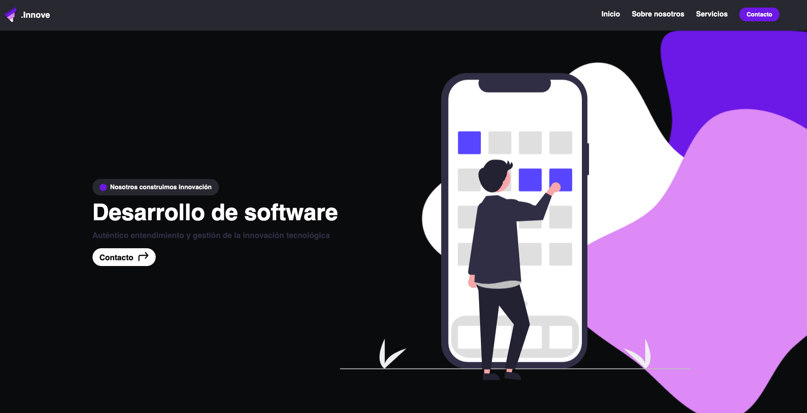
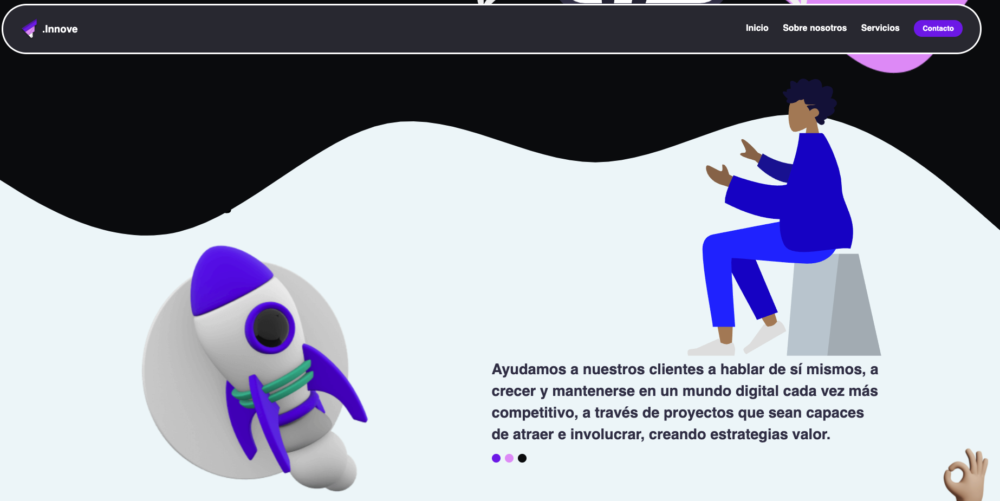
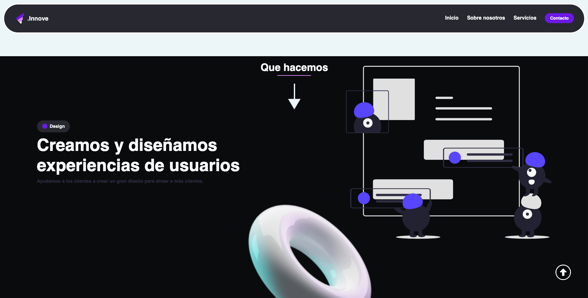
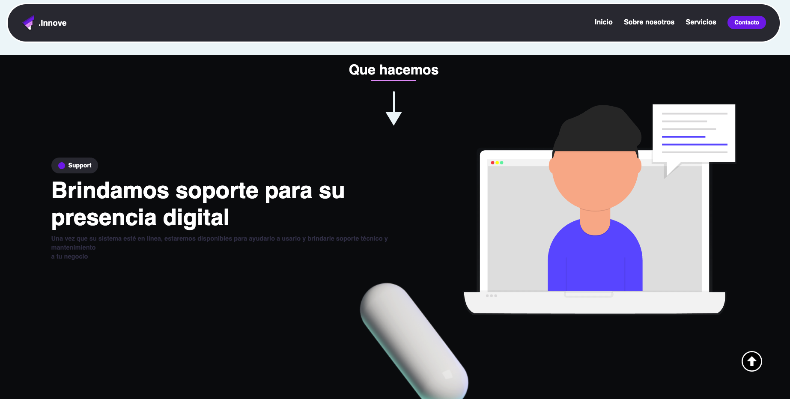
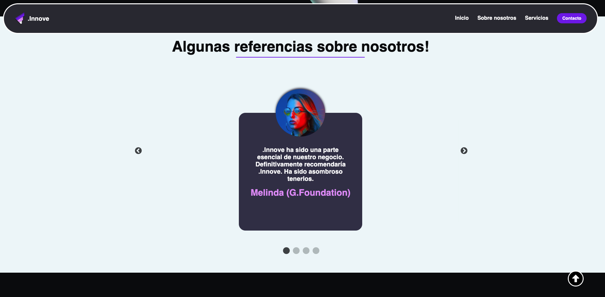
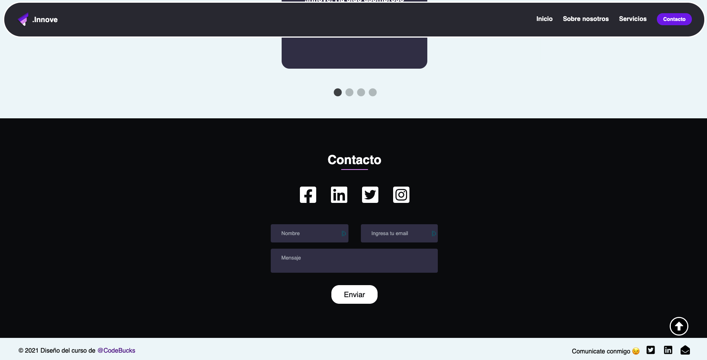
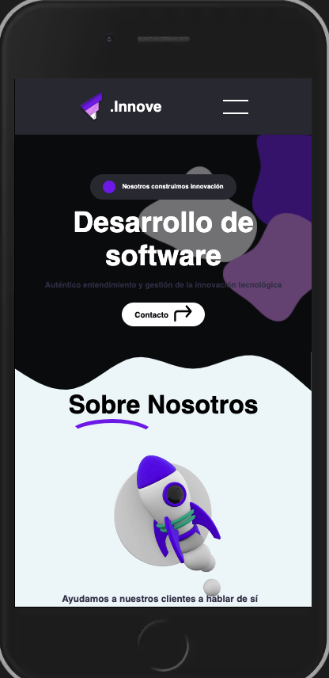
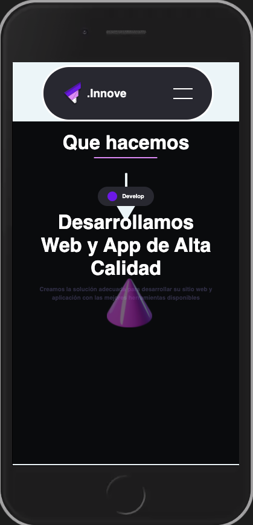
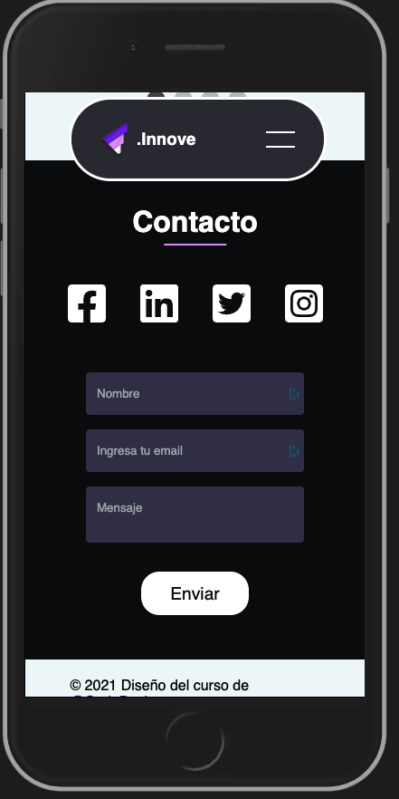
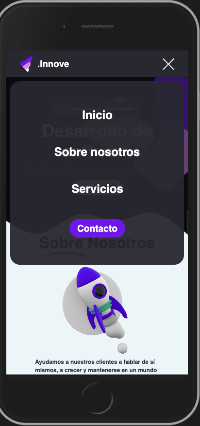

<p align="center">
    <h1>React Website🤩 : Build Responsive website with ReactJS, Styled-Components & GSAP</h1>
</p>

# Install
```
step 1 - yarn install
step 2 - yarn start  
```
-----------------------------------------
## English
### Author course @CodeBucks https://www.youtube.com/watch?v=aAEfBxcGpJ8&t=568s

## Build ReactjS website with GSAP for cool scrolling animations😇:

### For this project we're going to use,
* ▶️ React Hooks
* ▶️ GSAP for scrolling animations
* ▶️ Styled-Components
* ▶️ React-slick for Carousal 
* ▶️ DOM methods
* ▶️ Folder structure for React Projects
* ▶️ How to create Hamburger Menu with only css
* ▶️ How we can leverage advantages of component structure
* ▶️ How to use GSAP in React JS for awesome animations while scrolling
* ▶️ Many awesome CSS animations 


-----------------------------------------
## Español
## Construye un sitio web ReactjS con GSAP para animaciones de desplazamiento geniales😇:

### Para este proyecto usaremos,
▶ ️ React Hooks
▶ ️ GSAP para desplazarse por animaciones
▶ ️ Styled-Compoents
▶ ️ React-slick para Carousal
▶ ️ métodos DOM
▶ ️ Estructura de carpetas para proyectos React
▶ ️ Cómo crear un menú de hamburguesas con solo css
▶ ️ Cómo podemos aprovechar las ventajas de la estructura de componentes
▶ ️ Cómo usar GSAP en React JS para animaciones increíbles mientras se desplaza
▶ ️ Muchas animaciones CSS increíbles 

### Demo 1



### Demo 2



### Demo 3



### Demo 4


### Demo 5



### Demo 6



### Demo 7




### Demo Mobile 1



### Demo Mobile 2



### Demo Mobile 3



### Demo Mobile 4



# Video demostración:
[Youtube](https://www.youtube.com/watch?v=Bgb82cCue1g)


## Mi canal de youtube 

[Youtube](https://www.youtube.com/channel/UCQsrs_h91Q-baLx-n_rcdNg)

## Mis articulos en medium
[medium](https://devjaime.medium.com/)


## Mi twitter por si quieres contacterme
[medium](https://twitter.com/HsJhernandez)

### :heart: ¿Te gusto este proyecto?

Si te gusto este proyecto comparte y dale una estrella :star: en Github y no dudes en contactarme.